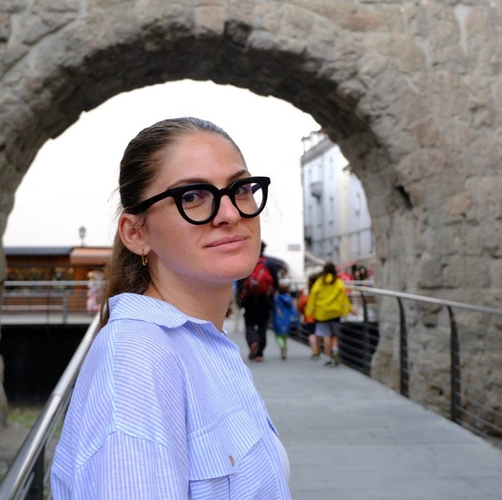
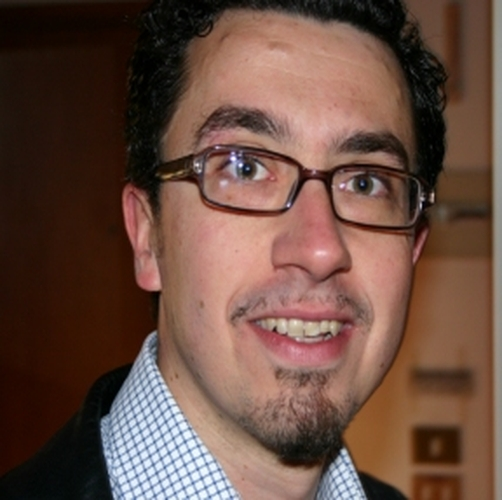
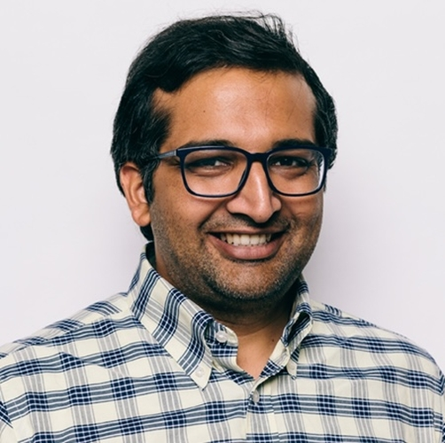

## Organizing Committee ##

<table>
    <col width="30%" />
    <col width="30%" />
    <col width="30%" />
    <tr>
        <td></td>
        <td></td>
        <td></td>
    </tr>
    <tr>
        <td> <a href='https://www.tudelft.nl/en/eemcs/the-faculty/departments/intelligent-systems/cybersecurityeemcs/people/andrea-agiollo'>Andrea Agiollo</a> <b> (Primary contact) </b> </td>
        <td> <a href='https://bardhienkeleda.github.io'>Enkeleda Bardhi</a> <b> (Primary contact) </b> </td>
        <td> <a href='https://www.unibo.it/sitoweb/paolo.bellavista'>Paolo Bellavista</a> </td>
    </tr>
    <tr>
        <td> TU Delft, The Netherlands </td>
        <td> TU Delft, The Netherlands </td>
        <td> University of Bologna, Italy </td>
    </tr>
    <tr>
        <td> 📧 <a href='mailto:A.Agiollo-1@tudelft.nl'>A.Agiollo-1@tudelft.nl</a> </td>
        <td> 📧 <a href='mailto:E.Bardhi-1@tudelft.nl'>E.Bardhi-1@tudelft.nl</a>  </td>
        <td> 📧 <a href='mailto:paolo.bellavista@unibo.it'>paolo.bellavista@unibo.it</a>  </td>
    </tr>
 </table>

 <table>
    <col width="30%" />
    <col width="30%" />
    <col width="30%" />
    <tr>
        <td></td>
        <td></td>
        <td>  </td>
    </tr>
    <tr>
        <td> <a href='https://rjvak7.github.io'>Rajiv Khanna</a> </td>
        <td> <a href='https://sites.google.com/diag.uniroma1.it/lazzerettiriccardo/home'>Riccardo Lazzeretti</a> </td>
        <td>  </td>
    </tr>
    <tr>
        <td> Purdue University, Indiana, USA </td>
        <td> Sapienza University of Rome, Italy </td>
        <td>  </td>
    </tr>
    <tr>
        <td> 📧 <a href='mailto:rajivak@purdue.edu'>rajivak@purdue.edu</a> </td>
        <td> 📧 <a href='mailto:lazzeretti@diag.uniroma1.it'>lazzeretti@diag.uniroma1.it</a>  </td>
        <td>  </td>
    </tr>
 </table>

## Keynote ##

TBD.

## Technical Program Committee ##

- Anish Acharya, *University of Texas Austin*
- Giovanni Apruzzese, *University of Liechtenstein*
- Silvia Bonomi, *Sapienza University of Rome*
- Alessandro Brighente, *University of Padua*
- Gianluca Capozzi, *Sapienza University of Rome*
- Stefano Cecconello, *University of Padua*
- Giovanni Ciatto, *University of Bologna*
- Nicolò Dal Fabbro, *University of Pennsylvania*
- Minoo Hosseinzadeh, *University of Kentucky*
- Giuseppe Antonio Di Luna *Sapienza University of Rome*
- Salma Kharrat, *KAUST*
- Stefanos Koffas, *Delft University of Technology*
- Matteo Mendula, *Centre Tecnologic de Telecomunicacions de Cataluya*
- Mirco Musolesi, *University College London*
- Alessandro Palma, *Sapienza University of Rome*
- Leonardo Querzoni, *Sapienza University of Rome*
- Boris Radovic, *KAUST*
- Savio Sciancalepore, *Eindhoven University of Technology*
- Rui Wang, *Delft University of Technology*
- Adrian Zapletal, *Delft University of Technology*