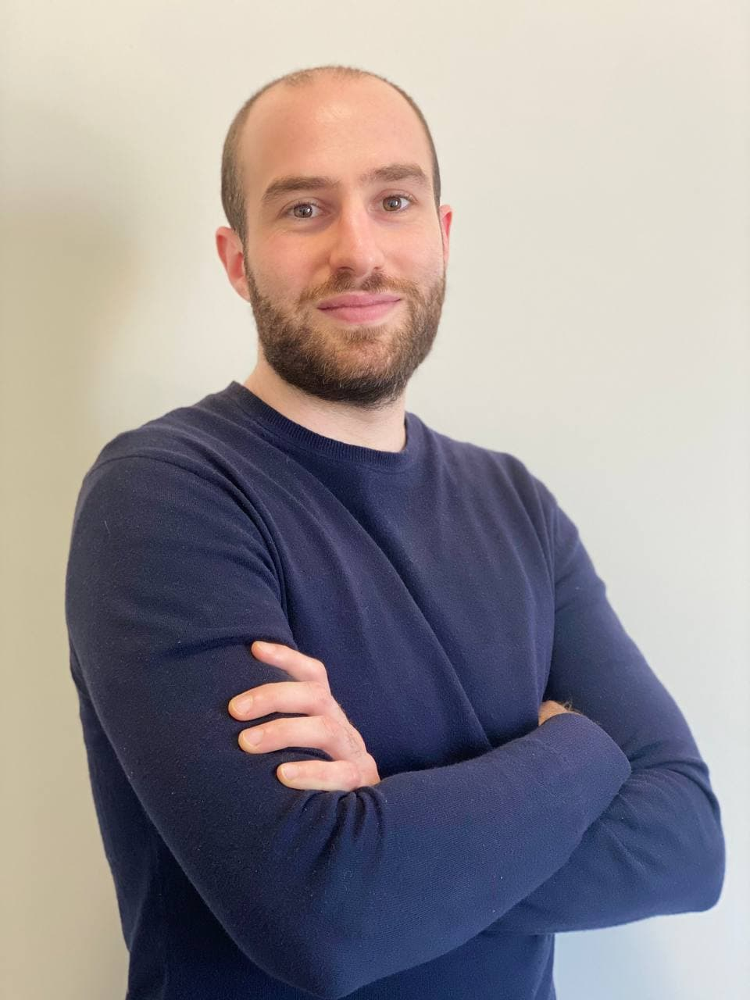

## Organizing Committee ##

<table>
    <col width="30%" />
    <col width="30%" />
    <col width="30%" />
    <tr>
        <td></td>
        <td></td>
        <td></td>
    </tr>
    <tr>
        <td> <a href='https://www.tudelft.nl/en/eemcs/the-faculty/departments/intelligent-systems/cybersecurityeemcs/people/andrea-agiollo'>Andrea Agiollo</a> </td>
        <td> <a href='https://bardhienkeleda.github.io'>Enkeleda Bardhi</a> </td>
        <td> <a href='https://www.unibo.it/sitoweb/paolo.bellavista'>Paolo Bellavista</a> </td>
    </tr>
    <tr>
        <td> TU Delft, The Netherlands </td>
        <td> TU Delft, The Netherlands </td>
        <td> University of Bologna, Italy </td>
    </tr>
 </table>

 <table>
    <col width="30%" />
    <col width="30%" />
    <col width="30%" />
    <tr>
        <td></td>
        <td></td>
        <td>  </td>
    </tr>
    <tr>
        <td> <a href='https://rjvak7.github.io'>Rajiv Khanna</a> </td>
        <td> <a href='https://sites.google.com/diag.uniroma1.it/lazzerettiriccardo/home'>Riccardo Lazzeretti</a> </td>
        <td>  </td>
    </tr>
    <tr>
        <td> Purdue University, Indiana, USA </td>
        <td> Sapienza University of Rome, Italy </td>
        <td>  </td>
    </tr>
 </table>

## Keynote ##

TBD.

## Technical Program Committee ##

TBD.